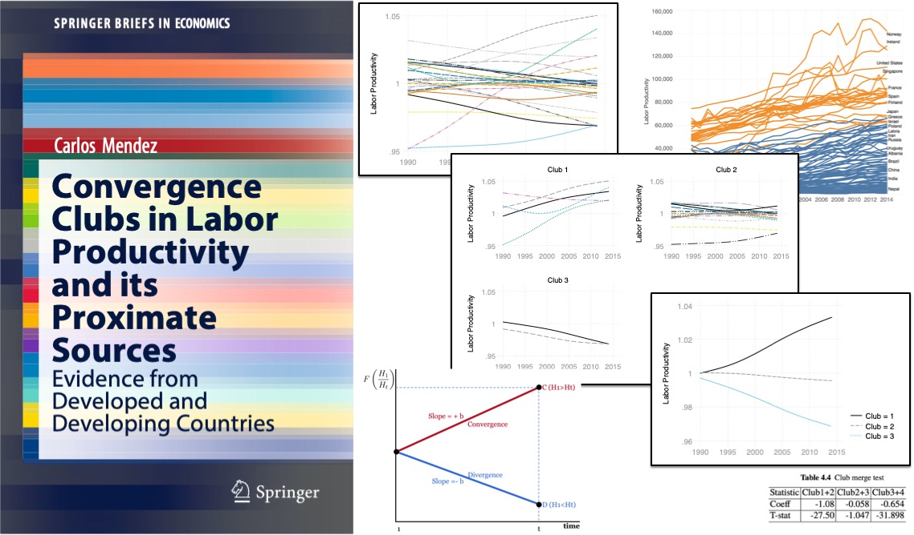

## About the book

Testing for economic convergence across countries has been a central issue in the literature of economic growth and development. This book introduces a modern framework to study the cross-country convergence dynamics of labor productivity and its proximate sources: capital accumulation and aggregate efficiency. In particular, recent convergence dynamics of developed as well as developing countries are evaluated through the lens of a non-linear dynamic factor model and a clustering algorithm for panel data. This framework allows us to examine key economic phenomena such as technological heterogeneity and multiple equilibria. Overall, the book provides a succinct review of the recent club convergence literature, a comparative view of developed and developing countries, and a tutorial on how to implement the club convergence framework in the statistical software Stata. These three features will help graduate students and researchers catch up with the latest developments and methodological implementations of the club convergence literature.

- About the author: <https://carlos-mendez.rbind.io>
- Related research: <https://quarcs-lab.rbind.io>
- Buy the ebook: TBA
- Buy the book: TBA

## Table of contents

1.  Introduction and overview
2.  Measuring labor productivity and its proximate sources
3.  A modern framework to study convergence
4.	Convergence clubs in labor productivity
5.  Convergence clubs in capital accumulation
6.  Convergence clubs in aggregate efficiency
7.  Concluding remarks and new research directions


| Tutorials                                                                           | Download datasets                                                                                                        |
|-------------------------------------------------------------------------------------|--------------------------------------------------------------------------------------------------------------------------|
| [Video Tutorial](https://youtu.be/FO8Ngl57HRQ)                                                                  | [Download full dataset](assets/dat.csv.zip?raw=true)                                                                     |
| [Convergence clubs analysis of developed countries using Stata](assets/tutorial-hiYes_log_lp.zip?raw=true)| [Download dataset definitions](assets/dat-definitions.csv.zip?raw=true); [See dataset definitions](/dat-definitions.csv)                                                 |
| [Explore the data using Python in Google Colab]()                                   | [Download R dataset of developed countries](assets/dat_hiNo.zip?raw=true)                                                |
| [Explore the data using R in R Studio Cloud](https://rstudio.cloud/project/1358320) | [Download R dataset of developing countries](assets/dat_hiYes.zip?raw=true)                                              |


## Tutorial: Convergence test and identification of clubs using Stata

[Du (2017)](https://www.stata-journal.com/article.html?article=st0503) introduced a Stata package to perform the econometric convergence analysis and club clustering algorithm of [Phillips and Sul (2007)](https://onlinelibrary.wiley.com/doi/abs/10.1111/j.1468-0262.2007.00811.x).
Although the package is well documented and easy to use, it does not include commands to create figures or export tables of results.
In what follows, the basic use of the package is described with some additional pieces of code to automate the creation of figures and export of results.


The code below installs the convergence clubs package and its dependencies. It is important to note that Stata 12.1 or higher is needed to run the convergence clubs package. In addition, to export the results to excel, Stata 14.2 or higher is needed to use the `putexcel` command. Finally, note that this installation should only be done once.

```
*-------------------------------------------------------
***************** Install packages*********************
*-------------------------------------------------------
* Install the convergence clubs package
findit st0503_1
net install st0503_1, from(http://www.stata-journal.com/software/sj19-1)
* Install package dependencies
ssc install moremata
*-------------------------------------------------------
```

After installing the package, we need to define some global (macro) parameters such as the name of the dataset (for example, `hiYes_log_lp`), the main variable to be studied (for example, `log_lp`), the label of that variable (for example, `Labor Productivity`), the type of cross-sectional unit (for example, `country`), and the type of temporal unit (for example,`year`). Users of this code should carefully check these five parameters as the next steps crucially depend on them to work correctly.

```
*-------------------------------------------------------
clear all
macro drop _all
set more off

*-------------------------------------------------------
***************** Define five global parameters*********
*-------------------------------------------------------
* (1) Indicate name of the dataset (Example: hiYes_log_lp.dta)
global dataSet hiYes_log_lp
* (2) Indicate name of the variable to be studied (Example: log_lp)
global xVar log_lp
* (3) Write label of the variable (Example: Labor Productivity)
global xVarLabel Labor Productivity
* (4) Indicate cross-sectional unit ID (Example: country)
global csUnitName country
* (5) Indicate temporal unit ID (Example: year)
global timeUnit year
*-------------------------------------------------------
```

To have a record of the written commands and results (excluding the display of figures), let us start a log file. The name of this file is automatically captured from the previously defined parameters.

```
*-------------------------------------------------------
***************** Start log file************************
*-------------------------------------------------------
log using "${dataSet}_clubs.txt", text replace
*-------------------------------------------------------
```

Next, from the current working directory,  we load the dataset, which is in a .dta format, and set the structure of the data. Again, we do not have to modify anything from this code as long as the global parameters are correctly defined.

```
*-------------------------------------------------------
***************** Load and set panel data  ***********
*-------------------------------------------------------
** Load data
use "${dataSet}.dta"

* Keep necessary variables
keep id ${csUnitName} ${timeUnit} ${xVar}

* Set panel data
xtset id ${timeUnit}
*-------------------------------------------------------
```

The next piece of code is the most important one of the entire package. It  runs the log-t convergence test, the clustering and merge algorithms, and lists the final results in a table. If we are using a log file, all code and results are recorded in the `dataSet_clubs.txt` file. In addition, by using the `putexcel` we can export the results in a table form to excel.  

```
*-------------------------------------------------------
***************** Apply PS convergence test  ***********
*-------------------------------------------------------
* (1) Run log-t regression
putexcel set "${dataSet}_test.xlsx", sheet(logtTest) replace
    logtreg ${xVar},  kq(0.333)

ereturn list
matrix result0 = e(res)
putexcel A1 = matrix(result0), names nformat("#.##") overwritefmt

* (2) Run clustering algorithm
putexcel set "${dataSet}_test.xlsx", sheet(initialClusters) modify
    psecta ${xVar}, name(${csUnitName}) kq(0.333) gen(club_${xVar})
matrix b=e(bm)
matrix t=e(tm)
matrix result1=(b \ t)
matlist result1, border(rows) rowtitle("log(t)") format(%9.3f) left(4)
putexcel A1 = matrix(result1), names nformat("#.##") overwritefmt

* (3) Run merge algorithm
putexcel set "${dataSet}_test.xlsx", sheet(mergingClusters) modify
    scheckmerge ${xVar},  kq(0.333) club(club_${xVar})
matrix b=e(bm)
matrix t=e(tm)
matrix result2=(b \ t)
matlist result2, border(rows) rowtitle("log(t)") format(%9.3f) left(4)
putexcel A1 = matrix(result2), names nformat("#.##") overwritefmt

* (4) List final clusters
putexcel set "${dataSet}_test.xlsx", sheet(finalClusters) modify
    imergeclub ${xVar}, name(${csUnitName}) kq(0.333) club(club_${xVar}) gen(finalclub_${xVar})
matrix b=e(bm)
matrix t=e(tm)
matrix result3=(b \ t)
matlist result3, border(rows) rowtitle("log(t)") format(%9.3f) left(4)
putexcel A1 = matrix(result3), names nformat("#.##") overwritefmt

*-------------------------------------------------------
```

To plot the dynamics of the cross-sectional units and their respective convergence clubs, we first need to re-scale the data based on the cross-sectional average of each year. The code below performs that task. The result of this code is an extended panel dataset (in both `.dta` and `.csv` formats) that includes the list of countries, club membership, and the absolute and relative values of the variable under study.


```
*-------------------------------------------------------
***************** Generate relative variables**********
*-------------------------------------------------------
** Generate relative variable (useful for ploting)
save "temporary1.dta",replace
use  "temporary1.dta"

collapse ${xVar}, by(${timeUnit})
gen  id=999999
append using "temporary1.dta"
sort id ${timeUnit}

gen ${xVar}_av = ${xVar} if id==999999
bysort ${timeUnit} (${xVar}_av): replace ${xVar}_av = ${xVar}_av[1]
gen re_${xVar} = 1*(${xVar}/${xVar}_av)
label var re_${xVar}  "Relative ${xVar}  (Average=1)"
drop ${xVar}_av
sort id ${timeUnit}

drop if id == 999999
rm "temporary1.dta"

* order variables
order ${csUnitName}, before(${timeUnit})
order id, before(${csUnitName})

* Export data to csv
export delimited using "${dataSet}_clubs.csv", replace
save "${dataSet}_clubs.dta", replace
*-------------------------------------------------------
```

Given the extended dataset, the code below plots multiple figures and export them as `.pdf` and `.gph` formats. There are three types of plots. First, the relative transition paths of all countries are plotted. This plot is useful as it provides a first graphical overview of dataset. Second, relative transition paths are plotted based on the club classification. Not only a plot for each club is created, but there is also a plot that compares all clubs using a common y-axis. Third, a plot based on within-club averages is also created. It is important to note that the colors and design of figures are based on the `plotplainblind` scheme. See @Bischof2017 for further information about the graphical scheme. This scheme can be installed by typing the following in the Stata console: `net install gr0070, from(http://www.stata-journal.com/software/sj17-3)`. Activate the scheme by typing: `set scheme plotplainblind`.  

```
*-------------------------------------------------------
***************** Plot the clubs  *********************
*-------------------------------------------------------
** All lines

xtline re_${xVar}, overlay legend(off) scale(1.6)  ytitle("${xVarLabel}", size(small)) yscale(lstyle(none)) ylabel(, noticks labcolor(gs10)) xscale(lstyle(none)) xlabel(, noticks labcolor(gs10))  xtitle("") name(allLines, replace)

graph save   "${dataSet}_allLines.gph", replace
graph export "${dataSet}_allLines.pdf", replace

** Indentified Clubs

summarize finalclub_${xVar}
return list
scalar nunberOfClubs = r(max)

forval i=1/`=nunberOfClubs' {
    xtline re_${xVar} if finalclub_${xVar} == `i', overlay title("Club `i'", size(small)) legend(off) scale(1.5) yscale(lstyle(none))  ytitle("${xVarLabel}", size(small)) ylabel(, noticks labcolor(gs10)) xtitle("") xscale(lstyle(none)) xlabel(, noticks labcolor(gs10))  name(club`i', replace)
    local graphs `graphs' club`i'
}
graph combine `graphs', ycommon
graph save   "${dataSet}_clubsLines.gph", replace
graph export "${dataSet}_clubsLines.pdf", replace

** Within-club averages

collapse (mean) re_${xVar}, by(finalclub_${xVar} ${timeUnit})
xtset finalclub_${xVar} ${timeUnit}
rename finalclub_${xVar} Club
xtline re_${xVar}, overlay scale(1.6) ytitle("${xVarLabel}", size(small)) yscale(lstyle(none)) ylabel(, noticks labcolor(gs10)) xscale(lstyle(none)) xlabel(, noticks labcolor(gs10))  xtitle("") name(clubsAverages, replace)

graph save   "${dataSet}_clubsAverages.gph", replace
graph export "${dataSet}_clubsAverages.pdf", replace

clear
use "${dataSet}_clubs.dta"

*-------------------------------------------------------
```

The code below exports the list of countries and their club membership to a `.csv` file. This list can be used as a handy reference in the appendix section of a publication.

```
*-------------------------------------------------------
***************** Export list of clubs  ****************
*-------------------------------------------------------
summarize ${timeUnit}
scalar finalYear = r(max)
keep if ${timeUnit} == `=finalYear'

keep id ${csUnitName} finalclub_${xVar}
sort finalclub_${xVar} ${csUnitName}
export delimited using "${dataSet}_clubsList.csv", replace
*-------------------------------------------------------
```

Finally, the code below closes the log file.

```
*-------------------------------------------------------
***************** Close log file*************
*-------------------------------------------------------
log close
*-------------------------------------------------------
```
